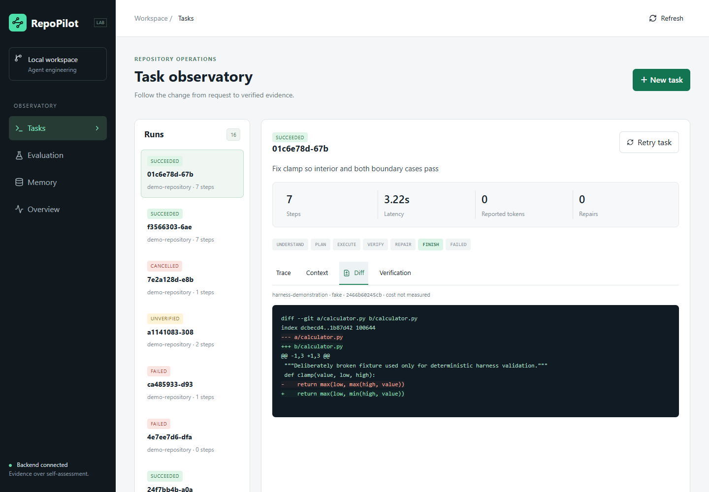
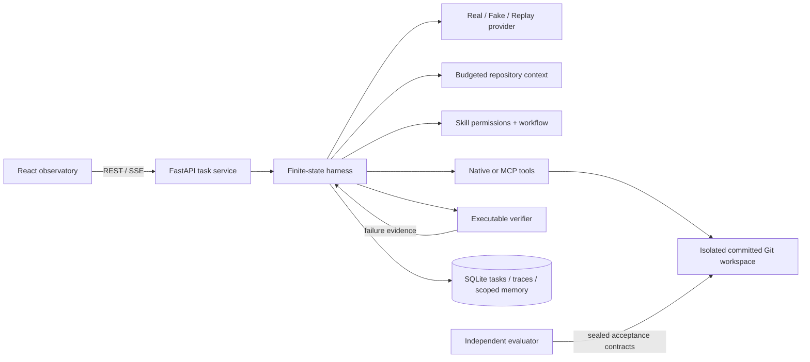
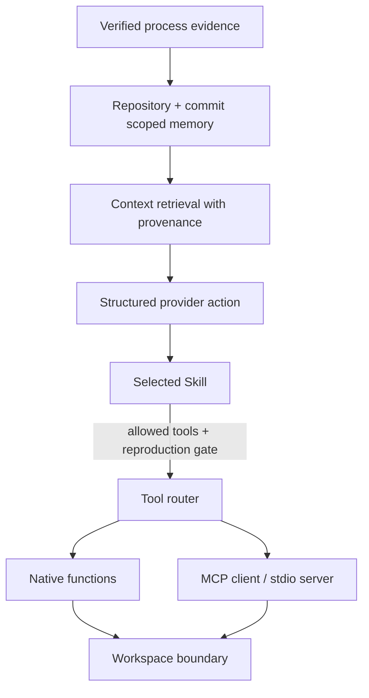

# RepoPilot

[](https://github.com/QiQiyzhu/repopilot/actions/workflows/ci.yml) · [A–T interview dossier](docs/interview-dossier.md) · [Verified Linux fullstack + container runtime](https://github.com/QiQiyzhu/repopilot/actions/runs/34445670524)

**A production-oriented coding agent harness and evaluation lab.** Submit a Git task, inspect the actual tool trace, and accept a change only when executable evidence passes. Python 3.12 · FastAPI · React · SQLite · MCP.

**Tests are green. Is the task complete?** Two authored regression tests each pass the full **93-test** ARC suite. An independent mutation check rejects the one that misses a diagonal-distance regression. [Inspect and reproduce the decision case](docs/decision-case-study.md) · [30-second / 3-minute / 8-minute interview walkthrough](docs/interview-deep-dive.md). No model provider is called; this is executable verification evidence, not an LLM score.

[Watch the 30-second local demonstration](docs/assets/demo.webm) · [Inspect the recorded MCP trace](docs/evidence/mcp-trace.json) · [Read the interview guide](docs/interview-guide.md)





The recorded demonstration is a **deterministic fixture repair**, not an LLM benchmark. It reproduces three failing clamp tests, edits one comparison, reruns pytest and shows the resulting diff. The MCP variant uses an actual initialized stdio MCP session; native patching and MCP test/read/diff calls appear distinctly in the trace.



## Evidence, with the limits attached

| Experiment | Observed result | What it means |
|---|---|---|
| Backend checks | **93 pass, 1 Windows privilege skip** | Lifecycle, safety, context, provider, MCP, API and negative-control contracts; [latest local record](docs/evidence/deepseek-validation.json) |
| Frontend checks | **4 unit + 7 browser checks pass** | Six real-backend workflows plus one intercepted DeepSeek submission contract; no paid CI requests |
| Docker Compose runtime | **Startup + backend restart pass** | Actual task/verification/diff/SSE through Nginx on 8080; [raw evidence](docs/container-runtime.md) |
| ARC task contracts | **36 / 36** positive/negative controls validated | Tasks have executable discriminating acceptance criteria |
| Add-test adequacy | **6 / 6** supplied incorrect behaviors rejected | Reference tests detect the intended mutation |
| Green-tests counterexample | **Both 93-test runs green; one candidate rejected** | Independent candidate-only mutation distinguishes test adequacy from suite success; [raw case](evaluation/results/decision-case.json) |
| Pinned ARC baseline | **92 tests**, typecheck and build pass | The archived evaluation baseline is viable |
| Five harness configurations | **5 / 5** known-fixture repairs pass external pytest | Configuration plumbing works; this is not model performance |
| DeepSeek integration probe | **1 actual response passed** | 107 input / 47 output tokens, 1047 ms; [raw receipt](docs/evidence/deepseek-smoke.json), nonce/schema only |
| DeepSeek authored fixture | **1 task accepted, 4 model calls** | Actual failure → model patch → 3 passing tests → independent recheck; 10,277 input / 323 output tokens, 5.437 s; [full trace](docs/evidence/deepseek-task.json) |
| Real-provider 36-task ablation | **Not run** | Integration probes do not establish coding success rates or ablation improvement |

[Machine-readable reports](evaluation/results/) contain actual process exit codes and measured timings. Reference patches validate the benchmark; they are never given to a provider. Tasks are clearly labelled **AI-assisted, authored exercises**, not invented historical defects or independently human-reviewed benchmarks.

| Known-fixture configuration | Steps | Measured latency | Retrieved memory chunks | Real model score |
|---|---:|---:|---:|---|
| Single-shot patch | 1 | 0.609 s | 0 | Not run |
| Agent + tools | 7 | 2.015 s | 0 | Not run |
| + verifier | 7 | 1.813 s | 0 | Not run |
| + context | 7 | 1.844 s | 0 | Not run |
| + memory / skills | 7 | 1.953 s | 2 | Not run |

These are **one scripted sample each**, with normal host scheduling noise. The shared known repair explains equal acceptance; no improvement or statistical significance is claimed. Full-system memory is deliberately warmed by a separately verified fixture run. See [evaluation methodology](docs/evaluation.md).

## Start locally

One-command container startup (Docker Compose required):

```sh
docker compose up --build
```

Open **http://localhost:8080**, then **Run MCP demo**. The API listens on localhost:8000; source workspaces persist in a named volume. [Actual Linux CI acceptance](docs/container-runtime.md) starts both images, executes a verified MCP fixture repair through the 8080 reverse proxy, and checks the same task and diff after a backend restart. The Windows development host has no Docker executable; these are real remote CI results.

Native development (Python 3.12 and Node 22):

```sh
python -m venv .venv
# Windows: .venv\Scripts\activate ; POSIX: source .venv/bin/activate
python -m pip install --require-hashes -r requirements.lock
python -m pip install --no-deps -e .
repopilot serve
# Second terminal:
cd frontend
npm ci --ignore-scripts
npm run dev
```

Open **http://127.0.0.1:5174**. No Redis, external database or API key is required. The fake provider repairs only the included fixture; arbitrary repository tasks require the real adapter or a matching replay.

```sh
repopilot demo --transport mcp --output outputs/demo.json
pytest -q
ruff check backend scripts
mypy backend/repopilot
npm --prefix frontend run test
npm --prefix frontend run typecheck
npm --prefix frontend run lint
npm --prefix frontend run build
# Start the backend first; the browser suite starts/reuses Vite automatically.
npm --prefix frontend run test:e2e
```

## Connect ARC//SHIFT

```sh
git clone https://github.com/QiQiyzhu/arc-shift.git ../arc-shift
npm ci --prefix evaluation --ignore-scripts
python -m repopilot.evaluation validate-contracts ../arc-shift
python scripts/validate_baseline.py ../arc-shift
python -m repopilot.evaluation ablate-fixture
```

The benchmark always materializes commit **`b17f4c24cf95a02d3197ec493026b6f23c8f2c3e`**; it never mutates the user's checkout. To submit your own repository through the UI, set `REPOPILOT_REPO_ROOT` to its containing directory before starting the backend. The demo repository must also be inside that root. Uncommitted source changes are intentionally excluded.

For real-provider work, use the [DeepSeek setup and bounded probe](docs/real-model-setup.md): set `DEEPSEEK_API_KEY`, `DEEPSEEK_MODEL` and `REPOPILOT_PROVIDER_FLAVOR=deepseek` in the server environment. `provider-check` makes zero network calls; `provider-smoke --execute` makes at most one 256-output-token request and executes no tools. The existing run selector remains `openai` for compatibility, while the explicit flavor selects DeepSeek. Keys never enter the frontend. Missing credentials, truncated/refused output and invalid usage fail visibly, with no Fake fallback. A smoke receipt is not a coding benchmark.

In the application, open **New task → Model provider → DeepSeek（服务端配置）**. The form displays the configured server model, blocks remote submission until DeepSeek configuration is present, and starts with **6 calls, zero retries, 16,000 total tokens and 180 seconds**. Advanced settings can lower those limits. Selecting a provider makes no model request; submitting the task does. The two demo buttons remain explicit zero-cloud-call fixture executions. Configuration readiness checks do not verify a key with the remote service.

```sh
# This is a paid API operation: run only when you choose to authorize it.
python scripts/run_model_benchmark.py ../arc-shift --confirm-paid-api --task-id arc-001-clamp-upper --profile full
```

## Boundaries and concepts

**Function calling** is the provider-to-harness structured action contract. **MCP** standardizes discovery and invocation across a process/transport boundary. **Skills** select permitted tools, order constraints and required verification evidence. These are different layers; none replaces the verifier.

The local runner is for **trusted repositories**. It enforces workspace-relative paths, secret-file exclusions, exact patches, argument allowlists, process timeouts, output limits, redaction and an explicit deletion approval gate. Repository tests are still arbitrary code and can access the host: an allowlist is **not an OS sandbox**. Docker adds a non-root container boundary, dropped capabilities and resource limits, but is not presented as a hostile multi-tenant service. Do not publish this execution API to the internet. [Threat model and residual risks](docs/security.md).

## Project map

```text
backend/repopilot/  models, protocols, providers, harness, verifier, tools, MCP, API
backend/tests/      executable security, lifecycle, MCP, context, provider and API checks
frontend/src/       task creation, trace/context/diff/verifier, memory and evaluation UI
frontend/e2e/       real backend browser workflows
skills/            five validated Markdown/YAML skill definitions
evaluation/tasks/  36 pinned ARC task definitions with independent contracts
evaluation/results/ actual reference controls, baseline and harness ablation evidence
scripts/           benchmark generation, real model evaluation, pinned baseline checks
docs/              architecture, failure cases, core code reading guide and portfolio
infra/             frontend image / nginx SSE proxy
```

[Architecture](docs/architecture.md) · [Agent loop](docs/agent-loop.md) · [Context engineering](docs/context-engineering.md) · [Memory](docs/memory.md) · [10 failure cases](docs/failure-cases.md) · [Validation record](docs/verification.md) · [API schema](docs/api-contract.json) · [Interview preparation](docs/interview-guide.md)

This is a portfolio engineering lab, not a claim of production adoption. The implementation was developed with AI assistance. The owner should explain its state machine, security boundary, failure evidence and evaluation limitations before using the résumé bullets.
