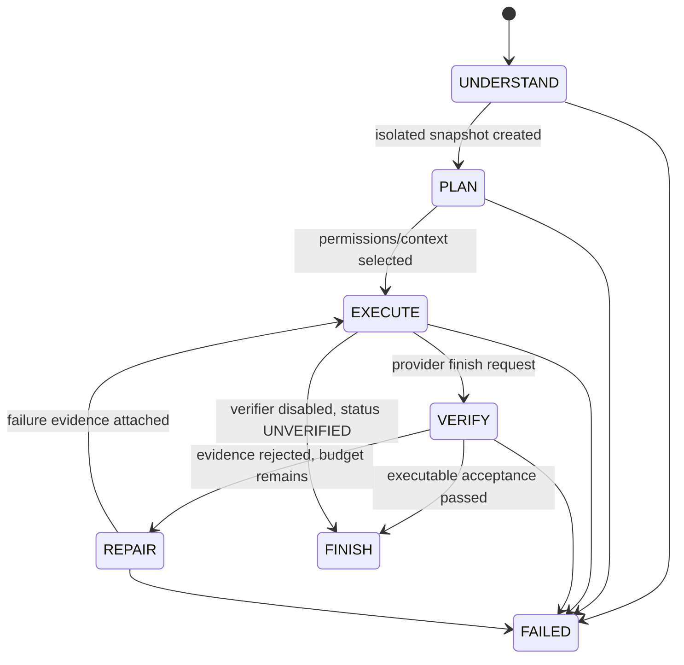

# The bounded execution state machine

`TRANSITIONS` rejects illegal state changes. The action loop is inside this state machine; a provider does not own the task status. Cancellation and timeout are terminal statuses attached to FAILED. Deletion approval is a paused task status inside EXECUTE and consumes the same deadline.

Budgets cap wall-clock duration, model actions, context size, reported tokens and repair attempts. Provider errors retry at most the configured count with bounded backoff. Cost is `null` unless the adapter has explicit configured token prices; a USD budget is rejected if those prices are absent. Reported usage is reconciled after each response, so a remote request may already have incurred its cost when an overrun is discovered. This is accounting and stop control, not a provider-side prepaid hard cap.

The bug-fix workflow refuses a patch until a test process has actually exited. A failed test is recorded as reproduction evidence; an attempted passing test alone does not prove a defect. `code-review` denies writes and process execution. `add-unit-test` requires a changed test path and passing unit check; `frontend-change` also requires syntax/typecheck; `performance-investigation` requires executable repository evidence and never infers a speedup.

The verifier checks process exit codes and file contracts, not a model's self-rating. External benchmark acceptance remains separate from in-loop verification so that every ablation is graded by the same evaluator. Candidate tests may be inadequate or adversarial: the ARC add-test tasks additionally apply an implementation mutation and require the new test to reject it.
