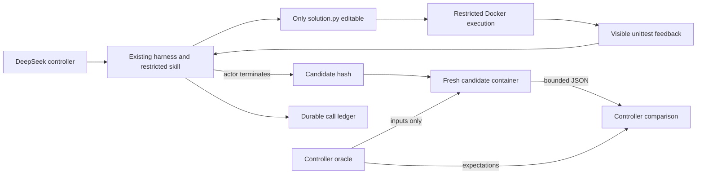

# Frozen development capsules

The actual RepoPilot harness now supports a frozen six-task evaluation with container-only code execution, controller-owned grading and a durable API ledger. This is **public, AI-assisted authored development data**. Runtime withholding does not make it a private held-out benchmark, SWE-bench result or contest submission. Paid results remain **not run** until an actual workflow receipt is attached. The historical one-task DeepSeek repair is separate.

## Research behind the design

- SWE-bench applies patches in Docker and distinguishes submitted, completed and resolved instances. Here, immutable image/source/candidate hashes and raw logs accompany outcomes; new attempts cannot overwrite old output directories. [Official FAQ](https://www.swebench.com/SWE-bench/faq/).
- Harbor offers separate verifier environments and explicit network/resource policies. This narrower adapter keeps oracle expectations outside the candidate container altogether. It does not claim Harbor compatibility. [Official task format](https://www.harborframework.com/docs/tasks).
- OpenAI's evaluation audit identifies prompt/test mismatches and tests that prescribe a particular implementation. Every tested behavior here is stated in the prompt; reference and broken implementations are checked before paid trials. Independent human annotation is still missing. [Primary methodology](https://openai.com/index/separating-signal-from-noise-coding-evaluations/).

## Frozen protocol

[`freeze.json`](../evaluation/capsules/v1/freeze.json) binds tasks, oracle, image digest, budgets and order. Hashes preserve JSON mapping declaration order because it affects dependency scheduling. Changing tasks, oracle or protocol after seeing scores requires a new pack version and experiment.

| Task | Contract | Runtime-withheld cases |
|---|---|---:|
| Retry policy | Status, attempt, deadline and Retry-After | 6 |
| Sliding quota | Exact expiry, zero and overdrawn balance | 6 |
| Dependency order | Stable selection, missing dependencies and cycles | 6 |
| Path scope | POSIX lexical components and sensitive names | 8 |
| Evidence status | Assertion failure versus timeout, signal and inconsistent records | 7 |
| Interval union | Touching, nested, empty, negative and repeated ranges | 6 |

Each task has two visible examples. Conditions share the explicit model, permissions, six actions, 20,000 observed tokens and 90 seconds. Full uses naive context selection at 6,000 estimated context tokens; compact uses structured selection at 900. This compares two complete configurations, not ranking alone. Both can read the same files. Memory/retries are disabled; full/compact order alternates. There is one run per condition, no best-of-N.

Batch limits: **72 attempted API calls**, 1,536 output tokens/call, 250,000 observed tokens and 1,200 seconds. Reservations are fsynced before HTTP. Provider errors/cancellation leave unknown billed usage and stop subsequent paid calls. Missing usage is not zero. Estimates precede calls and actual usage follows; one response can exceed an estimated bound. This is not a prepaid monetary lock. Unknown cost stays null.

Acceptance requires actor success, unchanged visible files, passing visible tests and all independent cases. Failed, malformed, exhausted and unstarted rows remain in the denominator. `completed` means the experiment ended, not that tasks passed. Report counts and observed usage without statistical-significance or generalization claims.

## Execution and authority



Containers have no network/API key, a non-root UID, read-only filesystem, no capabilities, no privilege escalation, 128 MiB memory, 0.5 CPU, 32 processes and bounded time/output. Only candidate code, visible tests and a fixed gateway are mounted. No oracle, repository, .git or Docker socket enters the container. The controller never executes candidate Python. Timeout/cancellation explicitly removes the UUID-owned container.

The capsule skill is outside the UI registry so the trusted-host runner cannot accidentally advertise Docker protection. Only native transport and small pure-Python capsules are supported. The general app remains a trusted-repository tool. Docker shares a kernel, and publicly available oracle knowledge cannot be ruled out. Input-integrity observations from the candidate process are regression checks, not cryptographic proof against a malicious program.

## Reproduction

No model or Docker is needed for a dry run:

```sh
python -m repopilot.capsule_eval --data /tmp/new-capsule-run --output /tmp/capsule-plan.json
```

Every push runs reference, broken-candidate, timeout, malformed-output and boundary controls on Linux with zero model calls. Manual [capsule-evaluation.yml](../.github/workflows/capsule-evaluation.yml) requires an operator-reviewed clean full SHA and temporary Actions secret `COMPETITION_DEEPSEEK_API_KEY`. The key exists only in the controller step after controls pass. Missing secret or mismatched SHA fails before a request. Remove the secret afterward.

```sh
gh workflow run capsule-evaluation.yml --ref codex/repopilot-v1 \
  -f expected_commit=REVIEWED_FULL_SHA -f model=deepseek-flash
```

Artifacts: controls.json, comparison.json, run/calls.jsonl and per-task SQLite traces/candidates. Preserve raw files before making a sanitized public receipt. Receipts retain the generation commit when documentation changes later. The 36-task ARC evaluation remains separate and unrun with a real model.

## Interview explanation

“I separated execution authority from grading authority. The actor edits one file; generated code cannot see host credentials or final expectations. I froze six public tasks and two equal-budget context configurations, retaining failed attempts. A timeout is inconclusive, not a mutation kill. Runtime withholding protects a run, but public tasks do not establish unseen-data generalization.”

Read capsule_eval.py for freezing, accounting and paired order; capsule_sandbox.py for mounts/process cleanup; harness.py for the adapter seam; and test_capsule_eval.py for adversarial contracts. Explain why readonly oracle files still leak answers, why reserving before HTTP matters, and why fewer prompt tokens help only when acceptance is preserved.
