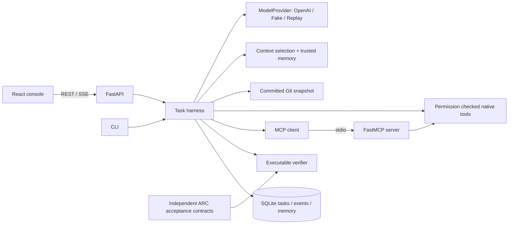

# RepoPilot：A–T 面试讲解手册

定位：production-oriented coding agent harness，供本地可信代码仓库使用。项目由 AI 辅助实现；候选人必须实际运行并读懂下列代码。它没有生产用户，没有真实模型解题率结论，也不是强隔离的多租户执行平台。

本轮新增 [冻结开发评估协议](capsule-evaluation.md)：6 个公开任务 × full/compact 两个条件，39 个运行时不提供给 actor 的验收用例。真正的 Harness 使用受限 Docker 执行代码，oracle 留在 controller；公共任务不是 held-out。真实模型结果待实际运行后填写，不能把零模型 controls 写成模型成绩。讲解重点是执行与判定权限分离、调用前持久化预留、失败保留，以及冻结后不按分数修改测试。

## A. 最终系统架构



运行时决定工具权限、预算、是否完成以及如何修复。模型只选择结构化 action。代码修改留在独立 snapshot，用户原始工作树保持不变。前端从真实 task/event/verification 数据构建界面，没有静态伪造仪表盘。

## B. Repository Tree

```text
RepoPilot/
├── backend/repopilot/
│   ├── api.py             # REST, SSE, lifecycle
│   ├── cli.py             # serve, demo, run
│   ├── harness.py         # state machine and budgets
│   ├── models.py          # validated contracts
│   ├── interfaces.py      # replaceable interfaces
│   ├── context.py         # lexical context selection
│   ├── providers.py       # real / fake / replay
│   ├── security.py        # process and path policies
│   ├── workspace.py       # isolated committed archive
│   ├── tools.py           # scoped repository tools
│   ├── skills.py          # validated skill policies
│   ├── mcp_client.py
│   ├── mcp_server.py
│   ├── store.py           # SQLite persistence
│   ├── verifier.py
│   └── evaluation.py
├── frontend/src/          # App, TaskForm, Panels, API
├── frontend/e2e/          # real-service browser tests
├── tests/                # backend tests
├── skills/               # five policy definitions
├── evaluation/
│   ├── tasks/arc-shift.json
│   ├── acceptance.cjs
│   └── results/           # executed results + not_run cells
├── scripts/              # baseline, benchmark, recording
├── docs/assets/           # actual UI screenshots and video
├── docs/evidence/         # validation and MCP trace JSON
├── infra/
├── Dockerfile
├── compose.yaml
└── .github/workflows/ci.yml
```

## C. Database Schema

SQLite 使用 WAL 和短事务；业务对象主体为 Pydantic JSON，检索字段独立建列。当前是单进程本地平台，未采用 PostgreSQL，也没有声称支持分布式 worker。

| Table | Columns | Purpose |
|---|---|---|
| tasks | id TEXT PRIMARY KEY, created TEXT, body TEXT | Task snapshot; trace 单独保存，避免整条事件历史反复写入 |
| events | sequence INTEGER PRIMARY KEY AUTOINCREMENT, task_id TEXT, body TEXT | 顺序事件与 SSE cursor；索引 event_task(task_id, sequence) |
| memory | id TEXT PRIMARY KEY, repository TEXT, commit_sha TEXT, valid INTEGER, body TEXT | 可信记忆与版本隔离；只检索同 repo、同 commit、valid=1 |

真实查询示例：`SELECT body FROM events WHERE task_id=? AND sequence>? ORDER BY sequence`。参数化 SQL 防止值被当成 SQL；event_task 索引服务于 task equality + sequence range。memory 目前小规模扫描筛选后排序，没有向量索引。tasks/events 没有外键和迁移框架，这是已知简化，扩到多进程前需补 migration、ownership、保留策略与一致性约束。

## D. RAG / Context Pipeline

本项目实现的是**带出处和预算的代码上下文检索**，不是完整 semantic RAG。流程是 repository tree → path / symbol / lexical score → file chunk → token estimate → budget selection → context manifest。结构化输入还包含上轮工具结果、失败信息、diff 和严格版本匹配的可信 memory。

naive baseline 直接选取有限文件；structured 根据词项、路径、文档和符号相关性排序，保存入选与丢弃原因。每段带文件、行范围、score 和估计 token。没有 embedding provider、向量数据库、cross-encoder 或 Recall@K 数据；因此不能把这个项目写成“实现 pgvector Hybrid RAG”。上下文 token 是近似预算，真实 provider usage 分开记账。

## E. Agent Workflow

七态：UNDERSTAND → PLAN → EXECUTE → VERIFY → FINISH；验证失败可进入 REPAIR，再执行；越界、耗尽或不可恢复错误进入 FAILED。显式转换表限制合法路径。UI 状态还区分 queued / running / awaiting_approval / cancelled / timed_out / unverified。

关键判断：模型返回 finish 仅触发验证；只有实际检查通过才能 succeeded。关闭 verifier 的消融标记 unverified。删除文件需要人工 approval，拒绝或取消留下事件。Replay 重放结构化 action，依然经过当前工具权限和验证，绝不直接重放“成功”。

## F. MCP 设计

官方 MCP Python SDK 的 FastMCP stdio server 暴露 repo.search、repo.read、tests.run、git.diff；客户端真正执行 initialize / call_tool / 进程生命周期管理。patch 是经过同一权限层的 native tool，trace 明确标注 native 或 mcp。

REST 面向应用请求，function calling 定义模型可选择的 action，MCP 标准化跨进程工具发现与调用，Skill 定义权限及验证策略。它们解决不同问题。`docs/evidence/mcp-trace.json` 是真实运行记录，不是手写示例。曾出现 pytest 继承协议 stdin 后阻塞；将子进程 stdin 改为 DEVNULL 后真实 MCP 流程通过。

## G. LLMOps 设计

Provider protocol 解耦 Fake / Replay / OpenAI compatible HTTP 调用。当前真实接入使用 DeepSeek flavor：服务端环境变量 key/model，显式官方端点、JSON Action、本地 schema 校验、thinking disabled 与 max_tokens。首次实际 nonce probe 为 1 次响应、107 input / 47 output tokens、1047 ms，见 [原始记录](evidence/deepseek-smoke.json)。它只验证连接和响应契约，没有测量解题率。没有密钥、截断、拒答或缺少 usage 都明确失败；401 不重试，429 只在任务预算内重试，单次 probe 不重试；读超时因计费结果未知也不重试。cost 只在配置价格时计算，未知为 null。Fake 是固定 fixture 驱动器；Replay 使用本地录制 action。

项目具备 trace、可配置 benchmark、版本固定的任务和可切换 harness profile，但没有完整 prompt registry、在线 A/B 发布、模型训练或生产 drift monitoring。CI 不调用付费 API。真实 provider benchmark 提供显式 opt-in CLI，尚未执行。

常规 push CI 仍然零付费。新增手动 capsule workflow 仅在操作者审阅 exact SHA 并提供临时专用 secret 后运行；full=naive/6000，compact=structured/900，其余任务、模型与动作预算相同。这是配置整体对照，不能把差异单独归因于排序。每次调用前 fsync reservation，失联/取消保留 unknown usage 并停止后续付费请求，不能把账单未知写成 0。

另外执行了一次真实 DeepSeek authored clamp 小任务：[完整脱敏 trace](evidence/deepseek-task.json)。四次模型调用自主复现失败、修改、复测、finish；独立 verifier 再次执行 3 项 pytest，并确认测试未改、只有 calculator.py 改动。实测 10,277 input / 323 output tokens、5.437 秒。它证明单个可信 fixture 的模型到执行再到验收链路可运行，不是 36 任务 benchmark，也不构成消融收益。具体配置与次数边界见 [real-model-setup.md](real-model-setup.md)。

应用的 New task 也可直接选择 DeepSeek，health 只返回配置状态、flavor 与 model；未配置时禁用提交。远程表单显式提交 6 steps/calls、16,000 total tokens、180 秒及 0 retries，并允许进一步降低。切换选项不触发请求，密钥只在服务端。浏览器的配置摘要没有声称已验证远端密钥有效性；付费副作用从任务提交开始。

## H. Reliability 机制

每任务有步骤、时间、token、修复次数和 provider retry 上限；最大并行任务为 2。子进程输出增量截断，超时终止进程树。取消传播到任务与进程；服务重启将未完成任务标记失败，retry 创建新的 task/workspace，保留原记录。

SQLite 事件序号支撑 SSE Last-Event-ID 恢复，断开浏览器只结束传输，不取消业务任务。前端同时具备状态轮询兜底。远端 API 已产生的 token/cost 不能撤销，因此预算是检测与停止边界，不能称为严格预付费额度锁。当前没有分布式队列或崩溃时逐 action 自动续跑。

## I. Security 机制

路径守卫拒绝 absolute / traversal / ADS / symlink 和敏感目录，归档展开也受同一边界约束。shell=False 使用显式 argv；命令 allowlist 只允许指定 checks。执行仓库代码必须显式 trust-code。删除需审批，code-review skill 禁止写入，patch 要求唯一匹配。secret 在结构化叶节点脱敏；子进程环境不继承 provider key。

这是一层应用策略，**不是 OS sandbox**：可信仓库的 pytest 仍可运行代码。Docker 有非 root、只读 rootfs、drop capabilities 等配置，并通过了真实 Linux CI 容器运行验收；Windows 开发机没有安装 Docker。公开多租户之前需要逐任务 VM/container 强隔离、认证授权、网络出口、secret broker、ownership 和资源配额。没有把普通 CORS 当身份认证。

## J. Test 数量与实际结果

| Executed check | Actual result | Scope / evidence |
|---|---|---|
| Python backend full suite | 113 passed, 1 skipped | 新增 20 个 capsule 契约；Windows symlink 权限 skip；[实际记录](evidence/capsule-local-validation.json) |
| Actual DeepSeek authored task | 1 accepted / 4 model calls | 3 pytest pass，独立复验；输入 10,277 / 输出 323 tokens；单个可见测试 fixture |
| Final API/MCP/archive targeted checks | 5 passed | 配置模块改动之后；后续 API annotation 检查 3 passed |
| Frontend unit | 4 passed | API 边界、错误、真实空值等 |
| Playwright browser | 7 passed | 6 项真实后端流程，加 1 项截获 DeepSeek POST 的配置与预算契约；CI 不调用付费模型 |
| Ruff / mypy | passed / 24 source files | backend/repopilot 与 scripts lint |
| Typecheck / lint / build | passed | frontend |
| npm audit | 0 vulnerabilities | 验证时实际结果，不代表永久安全 |
| Pinned ARC regression | 92 tests + typecheck + build passed | 只读源提交的独立 archive |

完整证据、命令和限制见 [verification.md](verification.md)。实际 Linux [CI run 34445670524](https://github.com/QiQiyzhu/repopilot/actions/runs/34445670524) 通过 58 项后端测试、6 项真实服务浏览器流程和真实 Docker Compose 运行验收。容器验收从 8080 的 Nginx 代理提交 MCP task，要求失败复现、修复后 pytest 的 3 项检查通过、真实 diff 与 verifier；重启后同一 task 和 diff 仍然存在，并保存原始 JSON/SSE/Compose logs。详见 [container-runtime.md](container-runtime.md)。这不是生产负载或多租户安全认证。

## K. RAG Benchmark 真实结果

没有 semantic RAG benchmark，不提供伪造 Recall/MRR。已执行的是 36 项 ARC acceptance 合同的正负对照：36/36 合同在负例失败、参考修改后通过；其中 6 个 add-test 任务均拒绝指定 mutant。它们证明任务检查能区分已设计的正负例，不能证明测试穷尽，更不能证明 LLM 解题率。

任务固定在 ARC 提交 `b17f4c24cf95a02d3197ec493026b6f23c8f2c3e`；覆盖 16 bug、6 add-test、6 small feature、4 refactor、2 performance contract、2 documentation consistency。性能合同关注避免 sqrt 及边界行为，没有虚构速度收益。

## L. Agent Ablation 真实结果

以下是每组一个**已知 deterministic fixture 的 harness wiring 验证**，不是真实模型 benchmark。外部 pytest 全部通过；工具错误中包含预期的失败复现。

| Profile | Steps | Recorded latency ms | Memory chunks | Tool errors |
|---|---:|---:|---:|---:|
| single-shot | 1 | 609 | 0 | 0 |
| tools | 7 | 2015 | 0 | 1 |
| verifier | 7 | 1813 | 0 | 1 |
| context | 7 | 1844 | 0 | 1 |
| full | 7 | 1953 | 2 | 1 |

全组 token=0、cost=null；full 的 memory 来自另一次已验证 fixture。真实模型五组均 not_run/null，因此不比较模型准确率。文件为 `evaluation/results/harness-ablation.json`。样本量 1、局部宿主和非随机运行顺序不支持因果性能结论。

## M. Performance 真实结果

目前只有上述 fixture latency 和真实测试耗时，没有并发负载、P50/P95/P99、生产 QPS 或节省费用的结论。设计上用异步调度、to_thread 迁移上下文 CPU/文件工作、bounded output 和 parallelism=2 控制资源；这不等于做过吞吐优化实验。下一步应固定硬件和样本，分离 provider latency / checkout / retrieval / tool / verifier，再多次运行报告分位数。

## N. 失败案例

十项已实现的故障控制或真实调试，复现依据见 [failure-cases.md](failure-cases.md)：路径穿越；不允许的命令；不信任仓库代码；patch 不唯一；provider 缺 key/无效结果；步骤/时间预算耗尽；审批拒绝；验证失败；replay 耗尽；取消/重试生命周期。它们是受控测试，不是生产事故。

额外真实调试：MCP 子进程 stdin 阻塞、untracked 文件缺失于 diff、`.gitignore` 被错误当作 `.git`、CRLF 导致整文件红绿，以及异步 retry 浏览器断言误读旧 task。均有代码或测试修复，更新后的 diff.png 只修改 return 一行；demo.webm 是实际 30.12 秒 UI 录屏。

## O. 尚未完成的问题

真实付费 LLM benchmark 未运行；semantic RAG 和 retrieval 指标未实现；生产多租户 sandbox 未实现；没有并发压力和统计性能结论；SQLite 没有 schema migration / event retention；无完整 prompt release registry；Windows symlink 安全测试因权限 skip（Linux CI 已通过该检查）。Docker 镜像构建及真实启动/MCP/重启持久化验收已经完成，不应继续列为未完成。真实 API 执行需要用户提供合法环境配置并授权费用。这些是简历边界，不能靠措辞抹掉。

## P. 10 个必须逐行读懂的 Backend 文件

| File | Read it to explain |
|---|---|
| models.py | action schema、任务状态、预算与 acceptance validation |
| harness.py | 状态转移、permission gate、repair、usage、取消和真实完成判断 |
| security.py | 路径解析、argv allowlist、流式输出、进程终止与脱敏 |
| workspace.py | committed snapshot、归档守卫与原始工作树隔离 |
| tools.py | patch 唯一性、换行保留、新文件 diff 和审批 |
| providers.py | real / fake / replay 行为、失败、费用和 usage 来源 |
| context.py | 词法排序、chunk provenance、预算选择及丢弃 |
| verifier.py | 真实 command exit code + diff + skill checks |
| mcp_client.py | ClientSession、initialize、stdio lifetime 与 transport |
| store.py | WAL、短事务、事件 cursor 与 memory 版本过滤 |

以上路径均相对 `backend/repopilot/`。补充阅读 api.py 的 SSE 与 skills.py 的验证策略。

## Q. 5 个必须读懂的 Frontend 文件

| File | Read it to explain |
|---|---|
| frontend/src/api.ts | REST 契约、错误传播、不向 GET 发送 body、null 不伪装为零 |
| frontend/src/App.tsx | SSE 连接、状态刷新、任务选中、审批/重试/取消 |
| frontend/src/TaskForm.tsx | demo 和真实任务区分、trust、replay、预算与 acceptance |
| frontend/src/Panels.tsx | context/diff/verification/evaluation/memory 的证据呈现 |
| frontend/e2e/observatory.spec.ts | 真实后端交互与等待新 task ID，避免旧状态竞态 |

## R. 10 段必须能手写或口述的关键代码

以下是需从实现中理解的核心逻辑摘要，不是完整可运行代码；面试时应指出对应文件，而不是背 API 名称。

1. **合法状态转换**：`if next_state not in TRANSITIONS[current]: raise ...`；为什么 FINISH 后不能悄悄再 EXECUTE？
2. **路径守卫**：拒绝危险路径组成后 resolve，并验证结果相对于 workspace；resolve 前后的检查分别解决什么问题？
3. **唯一 patch**：`count = text.count(old); if count != 1: fail`；为什么自动选择第一处匹配可能修改错误逻辑？
4. **换行保留**：raw bytes 识别 CRLF，统一匹配后恢复原 newline；避免无关整文件 diff。
5. **参数化 SQL**：`db.execute('SELECT body FROM events WHERE task_id=? AND sequence>? ORDER BY sequence', (task_id, after))`。
6. **事件增量**：保存全局 sequence，SSE 只发 cursor 之后事件，重连读 Last-Event-ID；前端允许重复刷新但不丢终态。
7. **进程边界**：显式 argv / shell=False / stdin=DEVNULL / bounded stdout / timeout / terminate tree；解释 stdin 为什么影响 MCP。
8. **Verifier 决定完成**：provider finish → execute acceptance → collect exit codes → succeeded 或 bounded repair；不是信任模型自报成功。
9. **Memory 可信过滤**：repository + exact commit + valid + trusted + provenance；为什么没有跨版本自动推广？
10. **实验正负对照**：negative setup → external check must fail → reference patch → same check must pass；为什么 reference 不应进入 provider context？

## S. 20 个面试追问题

1. **为何需要 harness 而非 while loop？** 生命周期、权限、预算、证据和验证是稳定的系统责任。
2. **何时任务成功？** 可执行 verifier 通过；关闭验证只能 unverified。
3. **Agent 与 workflow 区别？** 模型动态选 action，状态和 gate 是确定性的执行约束。
4. **MCP 与 function calling 区别？** 标准工具协议与模型动作契约分别位于传输和决策边界。
5. **Skill 为什么不是一段 prompt？** 这里声明工具权限、路径限制、先决步骤和验证要求，并在执行侧 enforce。
6. **为什么选择 SQLite？** 本地低并发可审计平台的复杂度足够；没有假装有分布式规模。
7. **SSE 为什么合适？** 服务器单向进度事件，HTTP 简单，cursor 可重连；命令走 REST。
8. **断开页面会停止任务吗？** 不会；取消是显式操作，否则继续持久化。
9. **重试会修改原工作树吗？** 不会；新 task 从指定 committed archive 创建独立 workspace。
10. **路径守卫足以隔离恶意 pytest 吗？** 不足；执行不可信代码需要 OS 级隔离。
11. **为什么不用全部文件做上下文？** 预算、噪声和无关依赖降低可用信息密度；但此处效果尚未用真实 LLM 验证。
12. **这是 Hybrid RAG 吗？** 不是，是结构化词法上下文选择；没有 embeddings/vector/reranker。
13. **memory 如何避免保存幻觉？** 只从验证完成记录生成可信条目，要求 provenance，并限制 repo/commit 和有效状态。
14. **哪些数字可以写进简历？** 已执行测试和合同数量；不把 fake fixture 通过率说成真实模型正确率。
15. **36 个合同证明什么？** 能区分已设计负例与参考实现；不能证明通用任务覆盖或模型能力。
16. **五组消融能证明架构越复杂越好吗？** 不能；当前样本只是 wiring 验证，真实实验未运行。
17. **成本预算能绝对防止超支吗？** 不能撤销已发生远端请求，必须说明计费来源与检测边界。
18. **最有价值的真实 bug 是什么？** MCP 协议 stdin 被 pytest 继承导致卡住，用 DEVNULL 修复并复验。
19. **公开上线前首先做什么？** 强隔离、认证授权、tenant ownership、网络/secret 边界、可靠队列和资源限制。
20. **AI 辅助代码如何证明自己理解？** 从失败 trace 定位、手写一个 gate/测试、解释边界并现场修改验证，坦诚 AI 辅助。

## T. 5 条基于真实结果的简历 Bullet 候选

- 基于 Python 3.12、FastAPI、React 和 SQLite 构建代码任务 Agent harness，实现七态执行、限次修复、取消/超时及可重连 SSE trace；后端实际验证 93 项通过、1 项因 Windows 权限跳过，覆盖 DeepSeek payload、计费未知、失败分类和调用次数边界。
- 实现 native tools 与真实 MCP stdio server/client，结合独立 Git snapshot、命令 allowlist、路径守卫、人工删除审批和实际 verifier；明确区分应用权限边界与 OS sandbox。
- 围绕 ARC//SHIFT 固定提交设计 36 项独立 acceptance 合同，全部通过负例失败/参考修改成功验证，其中 6 项补测试任务拒绝指定 mutant；基线 92 项回归测试、类型检查和构建通过。
- 实现带 provenance 和预算的代码上下文选择、严格版本隔离 memory 及五组 harness 配置，执行已知 fixture 对照并公开真实 LLM benchmark 未运行的边界。
- 建立前后端验证与可审计演示，实际通过 4 项前端单元测试、7 项浏览器检查（6 项真实后端流程、1 项远程模型提交契约）及 Linux Docker Compose 运行验收；通过 Nginx 代理验证 MCP 修复、可执行验收和重启后的任务持久化，保存原始 JSON 与容器日志。

使用前再次复验仓库对应提交。不要将“production-oriented”改成“已生产部署”，不要添加未测量的用户数、QPS、准确率提升或效率收益。
